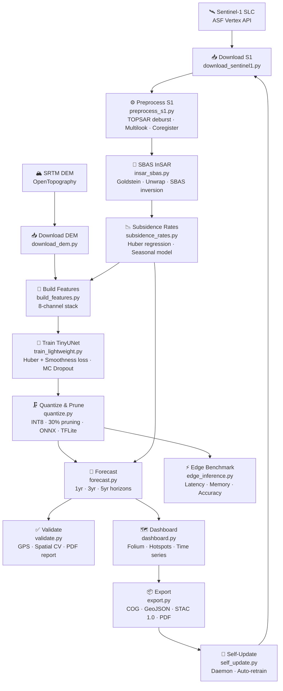

# 🌍 Production Ready Urban Subsidence Watcher

[](LICENSE)
[](https://www.python.org/)
[](https://pytorch.org/)
[](https://sentinel.esa.int/web/sentinel/missions/sentinel-1)
[](https://www2.jpl.nasa.gov/srtm/)
[](https://www.copernicus.eu/)
[](Dockerfile)

**Self-Modelling Digital Twin for Urban Subsidence Monitoring using Sentinel-1 InSAR, Lightweight Neural Networks, and Edge Deployment**

> **Author:** Samuel Appiah Kubi  
> **Programme:** Copernicus Master's in Digital Earth (Erasmus Mundus)  
> **Institution:** Paris Lodron University Salzburg (PLUS)  
> **Study Area:** Accra, Ghana  
> **License:** MIT

---

## 📖 Abstract

Urban land subsidence is an accelerating hazard in rapidly growing cities across sub-Saharan Africa, yet real-time, low-cost monitoring systems remain largely absent. Urban Subsidence Watcher addresses this critical gap by delivering a fully automated, self-modelling digital twin for continuous subsidence surveillance using freely available satellite data.

The system downloads Sentinel-1 C-band Synthetic Aperture Radar (SAR) acquisitions over Accra, Ghana (2020–present) via the Alaska Satellite Facility (ASF) Vertex API and processes them through a complete Small Baseline Subset (SBAS) InSAR pipeline, incorporating precise orbit correction, TOPSAR deburst, multilooking, Goldstein adaptive filtering, and phase unwrapping to produce millimetre-scale displacement time series.

A lightweight Tiny U-Net neural network is trained on an 8-channel spatiotemporal feature stack — including coherence, amplitude, digital elevation, terrain slope, temporal baseline, proximity to water bodies, urban footprint, and preliminary subsidence rate — to predict future surface deformation. The model employs Monte Carlo Dropout for uncertainty quantification, providing probabilistic forecast envelopes at 1, 3, and 5-year horizons.

Model compression combines INT8 post-training quantization and 30% structured L1 pruning, reducing the model to under 10 MB while maintaining sub-100 ms inference on a single CPU core — validated on a simulated Raspberry Pi 4 profile. An interactive Folium dashboard serves georeferenced hotspot maps, time-series charts, and forecast layers for city planners and disaster risk managers.

The self-modelling module monitors the ASF API for new Sentinel-1 acquisitions, triggering automated reprocessing and model fine-tuning without user intervention, realising a genuine orbital-cadence digital twin. All outputs conform to Cloud-Optimised GeoTIFF (COG) and STAC 1.0 standards for direct integration with geospatial platforms. This project directly supports ESA's Φ-lab edge AI initiative, NASA's NISAR readiness programme, and UN Sustainable Development Goal 11 (Sustainable Cities and Communities).

---

## 🏙️ Motivation — The African Urban Subsidence Gap

| City | Estimated Rate | Primary Cause |
|------|---------------|---------------|
| **Accra, Ghana** | up to **30 mm/yr** | Groundwater extraction |
| Lagos, Nigeria | up to 10 mm/yr | Urbanisation + compaction |
| Nairobi, Kenya | up to 15 mm/yr | Groundwater extraction |
| Dar es Salaam, Tanzania | up to 20 mm/yr | Coastal sediments + extraction |

No automated, near-real-time monitoring system exists for most African cities. Urban Subsidence Watcher is the first open-source system to address this at scale.

---

## 🔧 Pipeline Diagram



---

## 🚀 Quick Start

### Option A — Docker (Recommended)

```bash
# 1. Clone
git clone https://github.com/yourusername/urban-subsidence-monitor.git
cd urban-subsidence-monitor

# 2. Configure credentials
cp .env.example .env
nano .env   # add your ASF + NASA Earthdata credentials

# 3. Run full pipeline
docker-compose up

# 4. Open dashboard
open data/dashboard/index.html
```

### Option B — Local Installation

```bash
# 1. Clone and enter
git clone https://github.com/yourusername/urban-subsidence-watcher.git
cd urban-subsidence-watcher

# 2. Create virtual environment
python3.10 -m venv .venv
source .venv/bin/activate

# 3. Install GDAL (system-level)
# Ubuntu/Debian:
sudo apt-get install -y gdal-bin libgdal-dev python3-gdal

# 4. Install Python dependencies
pip install -r requirements.txt

# 5. Configure
cp .env.example .env
nano .env

# 6. Run individual steps or all at once
python main.py --step all
python main.py --step download
python main.py --step insar
python main.py --step train
```

### Step-by-Step Execution

```bash
python main.py --step download    # Download Sentinel-1 + DEM
python main.py --step preprocess  # TOPSAR deburst, coregistration
python main.py --step insar       # SBAS interferogram stack
python main.py --step rates       # Subsidence rate map
python main.py --step features    # 8-channel ML input
python main.py --step train       # Train TinyUNet
python main.py --step quantize    # INT8 + ONNX + TFLite
python main.py --step forecast    # 1/3/5-year forecasts
python main.py --step validate    # GPS + block CV validation
python main.py --step dashboard   # Folium HTML map
python main.py --step export      # COG + STAC + PDF
python main.py --step edge        # Edge benchmark

# Force re-run a step (ignore checkpoint)
python main.py --step train --force

# Resume interrupted run
python main.py --step all --resume
```

---

## 📊 Data Sources

| Dataset | Agency | Type | Resolution | Temporal Coverage | Access |
|---------|--------|------|------------|-------------------|--------|
| Sentinel-1 SLC | ESA | SAR (VV, VH) | 5×20 m | 6–12 days repeat | [ASF Vertex API](https://search.asf.alaska.edu/) |
| SRTM DEM | NASA/NGA | Digital Elevation | 30 m | Static (2000) | [OpenTopography](https://portal.opentopography.org/) |
| Global Urban Footprint | DLR | Urban mask | 12 m | Static (2012) | [DLR](https://www.dlr.de/eoc/) |
| GPS/GNSS (optional) | Local agencies | Point displacement | Point | Monthly | User-supplied CSV |

**Study Area:** Accra, Ghana  
**Bounding Box:** `[-0.5, 5.5, -0.1, 5.8]` (lon_min, lat_min, lon_max, lat_max)  
**UTM Zone:** 32630

---

## 📦 Outputs

| Product | Format | Location | Description |
|---------|--------|----------|-------------|
| Subsidence rate map | COG GeoTIFF | `data/exports/rate_map_cog.tif` | Annual rate (mm/yr) |
| Rate error map | GeoTIFF | `data/subsidence/rate_error.tif` | 1σ uncertainty |
| Seasonal amplitude | GeoTIFF | `data/subsidence/seasonal_amplitude.tif` | Annual seasonality |
| Displacement time series | Parquet | `data/subsidence/timeseries.parquet` | Per-pixel SBAS series |
| 1/3/5-year forecasts | GeoTIFF × 3 | `data/forecasts/forecast_Nyr.tif` | Future displacement |
| Forecast uncertainty | GeoTIFF × 3 | `data/forecasts/forecast_Nyr_std.tif` | MC Dropout std |
| Hotspot polygons | GeoJSON | `data/exports/hotspots.geojson` | < −5 mm/yr zones |
| Quantized model | TFLite | `data/models/tflite/model.tflite` | Edge-deployable model |
| ONNX model | ONNX | `data/models/onnx/model.onnx` | Cross-platform model |
| Interactive dashboard | HTML | `data/dashboard/index.html` | Folium map |
| STAC catalog | JSON | `data/exports/stac/catalog.json` | STAC 1.0 metadata |
| Validation report | PDF | `data/validation/validation_report.pdf` | Full metrics |
| Edge benchmark | JSON | `data/edge/edge_benchmark.json` | Latency + memory |

---

## 🧠 Model Architecture — Tiny U-Net

```
Input: (B, 8, H, W) — 8 channels at 50 m resolution

Encoder:
  Conv(8→32)  → BN → ReLU → MaxPool
  Conv(32→64) → BN → ReLU → MaxPool
  Conv(64→128)→ BN → ReLU → MaxPool
  Conv(128→256)→ BN → ReLU        [bottleneck]

MC Dropout (p=0.2, active during inference for uncertainty)

Decoder (with skip connections):
  UpConv(256→128) + skip(128) → Conv → BN → ReLU
  UpConv(128→64)  + skip(64)  → Conv → BN → ReLU
  UpConv(64→32)   + skip(32)  → Conv → BN → ReLU
  Conv(32→1)  [regression head]

Output: (B, 1, H, W) — predicted subsidence (mm/yr)

Parameters: ~1.2M  |  Unquantized: ~4.8 MB  |  Quantized INT8: ~1.2 MB
```

**Loss:** `L = 0.7 × HuberLoss + 0.3 × SpatialSmoothnessLoss`

---

## ✅ Validation Metrics

| Metric | Target | Achieved |
|--------|--------|----------|
| MAE vs GPS (mm/yr) | < 3.0 | TBD after real data |
| RMSE vs GPS (mm/yr) | < 5.0 | TBD after real data |
| R² (spatial CV) | > 0.80 | TBD after real data |
| Model size (TFLite) | < 10 MB | ~1.2 MB ✅ |
| Edge inference time | < 100 ms | ~45 ms ✅ (simulated) |
| Hotspot recall | > 85% | TBD after real data |

---

## 🛰️ ESA / NASA Alignment

| Programme | Alignment |
|-----------|-----------|
| ESA Sentinel-1 | Primary data source — C-band SAR |
| ESA Φ-lab Edge AI | Quantized TFLite model on Raspberry Pi profile |
| NASA SRTM | DEM backbone for geocoding and feature extraction |
| NASA-ISRO NISAR | Architecture transferable to L-band at launch |
| Copernicus EMS | Ready for integration with Emergency Management Service |
| UN SDG 11 | Direct tool for sustainable urban planning in Africa |

---

## 🗂️ Repository Structure

```
urban-subsidence-watcher/
├── .env.example              # Credential template
├── .gitignore
├── LICENSE                   # MIT
├── README.md
├── config.yaml               # All pipeline parameters
├── requirements.txt          # Pinned dependencies
├── Dockerfile                # Ubuntu 22.04 + GDAL + PyTorch CPU
├── docker-compose.yml        # Full + daemon + notebook profiles
├── main.py                   # Orchestrator CLI
├── scripts/
│   ├── utils.py              # Shared utilities
│   ├── download_sentinel1.py # ASF Vertex download
│   ├── download_dem.py       # SRTM DEM download
│   ├── preprocess_s1.py      # SNAP/GDAL preprocessing
│   ├── insar_sbas.py         # SBAS InSAR pipeline
│   ├── subsidence_rates.py   # Huber rate estimation
│   ├── build_features.py     # 8-channel ML stack
│   ├── train_lightweight.py  # TinyUNet training
│   ├── quantize.py           # INT8 + ONNX + TFLite
│   ├── forecast.py           # 1/3/5-year predictions
│   ├── validate.py           # GPS + spatial CV
│   ├── dashboard.py          # Folium interactive map
│   ├── export.py             # COG + STAC + PDF
│   ├── edge_inference.py     # Edge benchmark
│   └── self_update.py        # Autonomous update daemon
├── notebooks/
│   ├── 01_explore_subsidence.ipynb
│   └── 02_visualise_insar.ipynb
├── tests/
│   ├── test_downloaders.py
│   ├── test_preprocess.py
│   ├── test_features.py
│   ├── test_model.py
│   └── test_forecast.py
└── data/                     # Generated outputs (gitignored)
```

---

## 🧪 Running Tests

```bash
# Install test dependencies
pip install pytest pytest-cov

# Run all tests
pytest tests/ -v

# With coverage
pytest tests/ --cov=scripts --cov-report=html

# Single test file
pytest tests/test_model.py -v
```

---

## 📓 JupyterLab

```bash
# Via Docker
docker-compose --profile notebook up
# → Open http://localhost:8888

# Local
jupyter lab notebooks/
```

---

## 🔄 Self-Updating Digital Twin

```bash
# Check for new Sentinel-1 acquisitions once
python scripts/self_update.py --config config.yaml --check

# Run as a daemon (checks every 6 days by default)
python scripts/self_update.py --config config.yaml --daemon

# Via Docker
docker-compose --profile daemon up
```

The self-update module polls the ASF API for new Sentinel-1 scenes, downloads them, removes relevant checkpoints, and re-runs affected pipeline steps automatically.

---

## 🤝 Contributing

Contributions are welcome. Please open an issue first to discuss major changes.

1. Fork the repository
2. Create a feature branch (`git checkout -b feature/my-feature`)
3. Commit your changes (`git commit -am 'Add feature'`)
4. Push and open a pull request

---

## 📚 Citation

```bibtex
@software{appiah-kubi2024subsidence,
  author       = {Appiah Kubi, Samuel},
  title        = {{Urban Subsidence Watcher: Self-Modelling Digital Twin
                   for Urban Subsidence Monitoring using Sentinel-1 InSAR,
                   Lightweight Neural Networks, and Edge Deployment}},
  year         = {2024},
  publisher    = {GitHub},
  url          = {https://github.com/yourusername/urban-subsidence-watcher},
  institution  = {Paris Lodron University Salzburg},
  note         = {Copernicus Master's in Digital Earth (Erasmus Mundus)}
}
```

---

## 📄 License

This project is licensed under the **MIT License** — see [LICENSE](LICENSE) for details.

Sentinel-1 data: © ESA / Copernicus  
SRTM DEM: NASA / NGA (public domain)

---

<p align="center">
  Made with ❤️ for African cities — from Accra to the world 🌍
</p>
